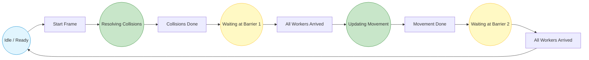

# Behaviour

To model the concurrent behavior and synchronization flow of the physics engine—specifically the two-phase barrier 
coordination between the master thread and worker threads—we can utilize a **Petri Net** abstraction.

### Petri Net Model of the Two-Phase Barrier Cycle
In this model, places represent the operational states of the system or workers, while transitions represent 
synchronization events (such as entering the barrier, waiting, or releasing threads).

### Behavioral Description
- **Phase Initialization ($T_1$):** The master thread triggers a simulation tick, transitioning workers from idle/ready state
($P_1$) into the parallel collision resolution phase ($P_2$).
- **First Synchronization Barrier ($P_3 \rightarrow T_3$):** Once a worker completes its assigned rows, it reaches the 
SimpleBarrier ($P_3$). It suspends execution via condition variables until all peer worker threads arrive, avoiding premature state modifications.
- **Movement Phase ($P_4$):** Upon barrier release, workers transition to updating entity positions and velocities ($P_4$).
- **Second Barrier & Reset ($P_5 \rightarrow P_1$):** A second synchronization barrier ($P_5$) guarantees that spatial 
transfers and boundary checks are globally finalized before the frame counter increments and the cycle loops back to idle.