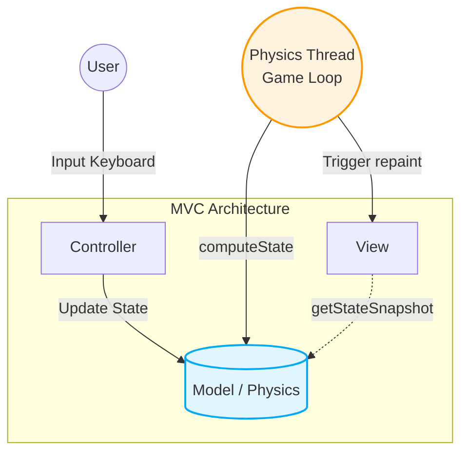
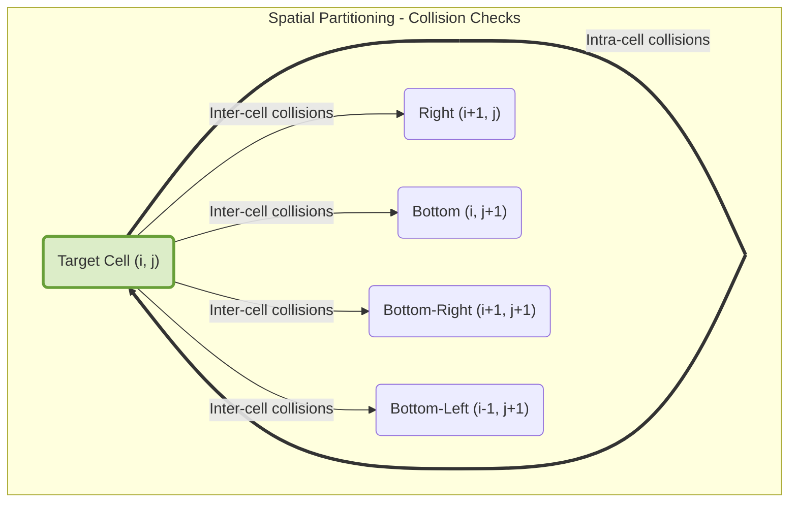
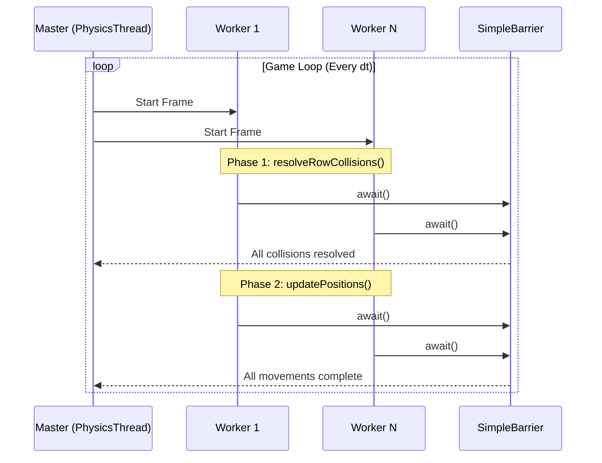
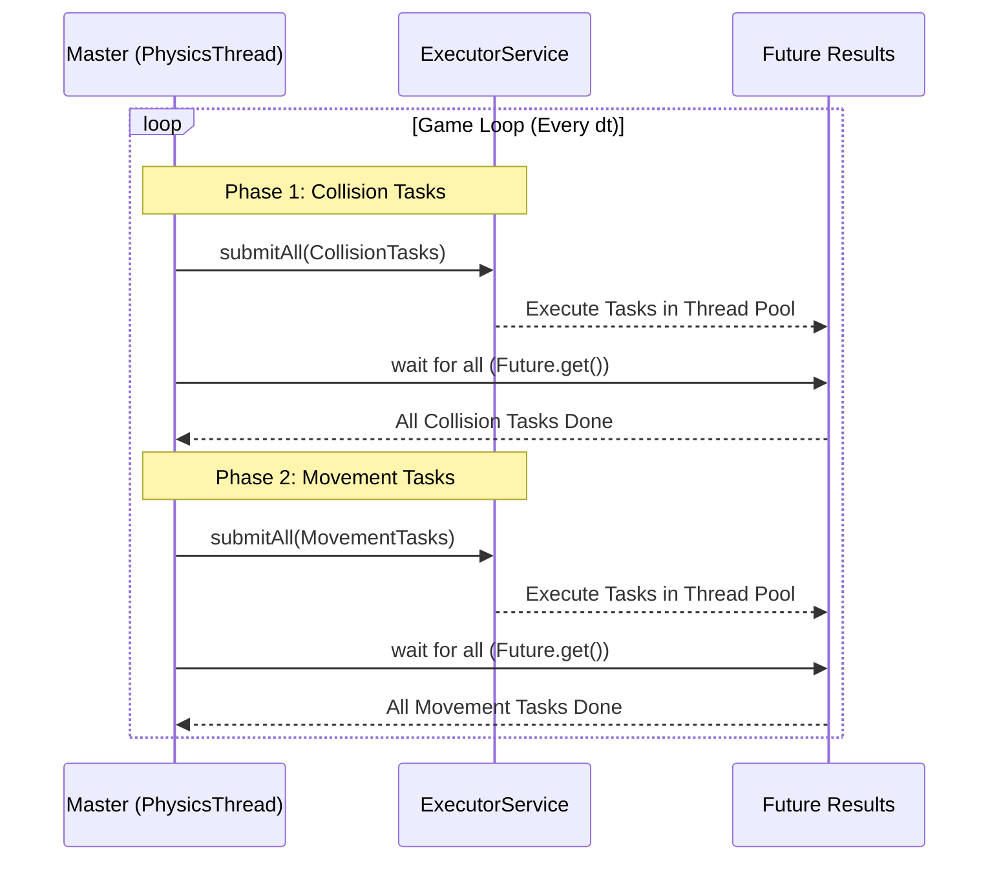

# Design

### System Architecture
The system relies on a strictly decoupled Model-View-Controller (MVC) architectural pattern. The **Model** acts as the core component, fully encapsulating the physics simulation, spatial state, and entity properties without any dependency on the graphical interface. The **View** is implemented as a passive observer that retrieves state snapshots from the model to render the visual representation at a fixed frame rate. Bridging the two, the **Controller** captures asynchronous user input and dispatches corresponding commands to the Model.

The execution is driven by a dedicated active physics thread, functioning as the primary game loop. This thread continuously computes the simulation state based on a fixed time delta (`dt`) and subsequently triggers the View to repaint, ensuring the simulation logic remains decoupled from the UI rendering cycle.

### Spatial Decomposition
To mitigate the $O(N^2)$ computational complexity inherent in global collision detection, the physics engine employs a spatial partitioning strategy. The simulation board is subdivided into a two-dimensional grid of independent cells. Each ball is mapped to exactly one cell based on its current spatial coordinates.

This grid-based decomposition serves a dual purpose: it drastically reduces the number of distance calculations required by restricting collision checks to local neighborhoods, and it creates isolated memory boundaries that naturally facilitate concurrent processing.

To guarantee that collisions between balls residing in adjacent cells are evaluated exactly once—and to prevent race conditions during concurrent boundary access—collision checks are strictly directional. When processing a specific cell, the engine evaluates interactions with entities solely within its own bounds and four designated neighboring cells: Right, Bottom, Bottom-Right, and Bottom-Left.

### Physics Engine Implementations
The simulation supports three distinct execution strategies. All variants share the underlying spatial decomposition logic but differ significantly in their concurrency models and task management.

#### 1. Sequential Implementation
The baseline implementation operates on a single thread of execution. It sequentially iterates through the entire spatial grid, first evaluating all intra-cell and inter-cell collisions, and subsequently updating the positional vectors of all entities. This deterministic model serves as the primary computational baseline for performance and correctness evaluation.

#### 2. Multithreaded Implementation (Platform Threads)
The primary concurrent architecture utilizes a Master-Worker pattern backed by native platform threads. A single master thread oversees the simulation loop, while a fixed pool of persistent worker threads is instantiated during system startup to process the physics logic.

The spatial grid is partitioned horizontally, with each worker permanently assigned a specific contiguous subset of rows. To maintain memory consistency and prevent read-write hazards between the collision and movement phases, the master thread orchestrates a strict two-phase synchronization protocol utilizing cyclic barriers:
1. **Collision Phase:** Workers independently resolve collisions within their assigned rows.
2. **Barrier Wait:** All threads halt at the barrier until global collision resolution is achieved.
3. **Movement Phase:** Workers apply velocity vectors to update spatial positions for their assigned entities.
4. **Barrier Wait:** All threads halt again, ensuring global spatial consistency before advancing the game clock.

#### 3. Executor-Based Implementation
To leverage modern Java concurrent utilities, the third implementation abstracts thread lifecycle management using an `ExecutorService` thread pool. Instead of assigning persistent rows to statically bound threads, the spatial grid's workload is encapsulated into discrete, stateless tasks.

During each simulation tick, the master thread submits a batch of `Callable` tasks (representing row or cell processing jobs) to the Executor. Synchronization is inherently managed by awaiting the completion of all `Future` objects representing the collision phase before generating and submitting the subsequent batch of movement tasks. This approach decouples workload definition from execution, allowing the underlying JVM to optimize thread scheduling and load balancing dynamically.

